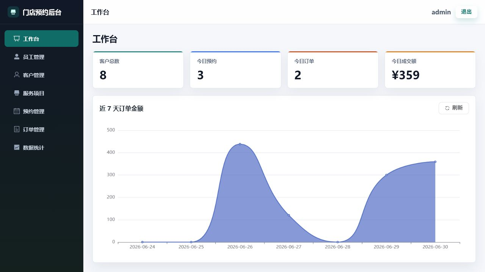
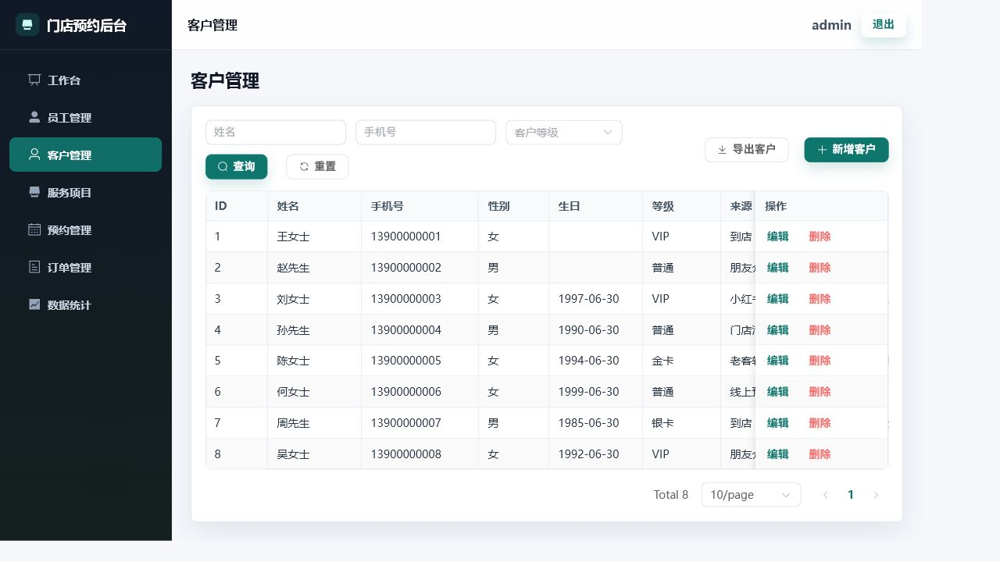
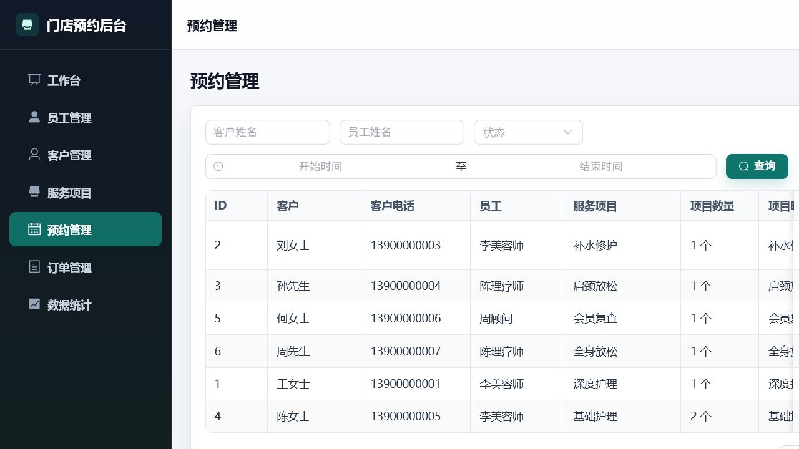
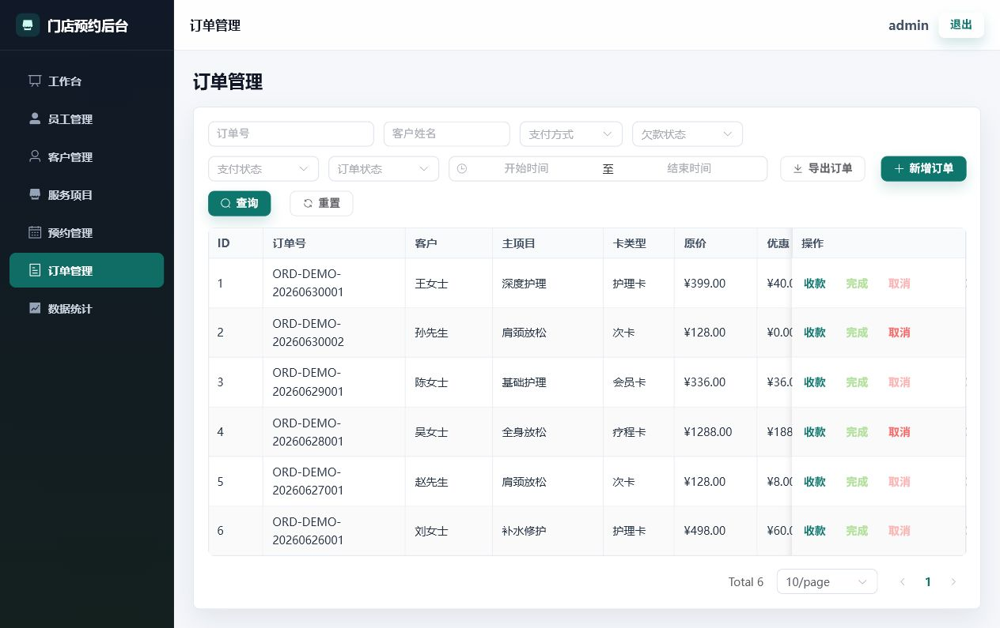
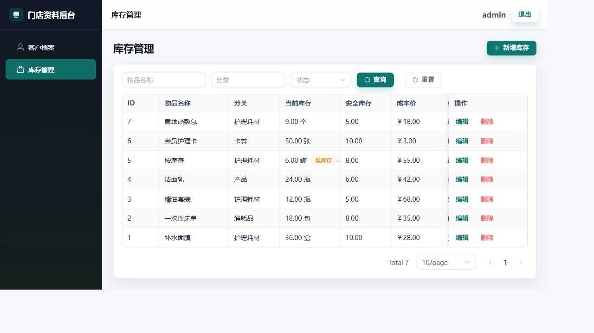
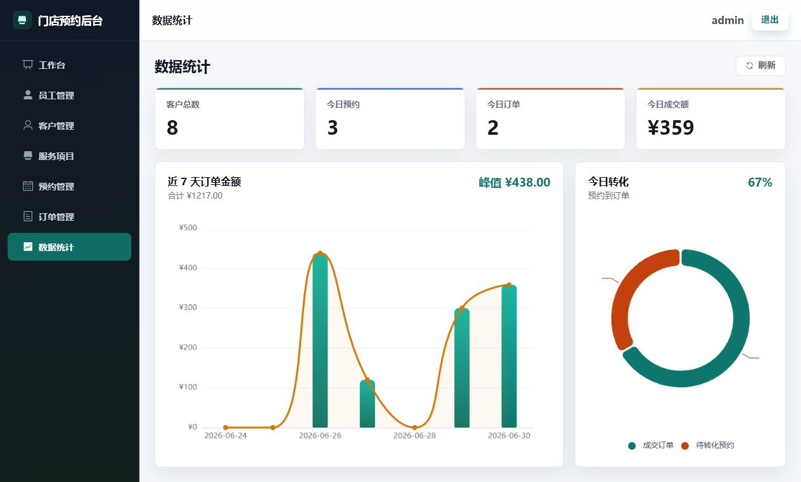

# 门店预约与库存管理系统

门店预约与库存管理系统是一个面向线下门店日常经营场景的后台管理项目，采用前后端分离架构，包含 Spring Boot 后端、Vue 管理端前端、客户/库存前端，以及 Windows 一键启动脚本和 H2 便携运行配置。

项目覆盖员工管理、客户管理、服务项目、预约管理、订单收款、库存管理、经营统计、登录认证、只读账号控制和 Excel 导出等功能，适合作为 Java 后端练习项目、后台管理系统原型和本地演示项目。

## 项目说明

本项目主要用于学习和展示 Spring Boot、MyBatis-Plus、JWT 登录认证、分页查询、权限拦截、Spring Cache、Redis 缓存、Excel 导出、前后端分离开发、数据库设计和本地便携部署流程。

项目业务场景参考线下门店管理需求，重点不是复杂算法，而是完成一个较完整的后台管理系统闭环。

## 项目地址

```text
https://github.com/kkey-code/store_appointment.git
```

## 项目截图

### 登录页


### 工作台



### 客户管理



### 预约管理



### 订单管理



### 库存管理



### 数据统计



## 技术栈

### 后端

- Java 17
- Spring Boot 3.5.16
- Spring MVC
- MyBatis-Plus
- JWT
- Spring Cache
- Redis
- EasyExcel
- Maven

### 数据库

- MySQL 8
- H2 文件数据库

### 前端

- Vue 3
- TypeScript
- Vite
- Element Plus
- Axios
- ECharts

## 功能模块

### 管理端 `frontend`

- 登录
- 工作台
- 员工管理
- 客户管理
- 服务项目管理
- 预约管理
- 订单管理
- 数据统计
- 客户导出
- 订单导出

### 客户 / 库存端 `frontend_customer_inventory`

- 登录
- 客户档案维护
- 库存管理
- 客户导出

### 后端接口模块

| 模块 | 接口前缀 | 说明 |
| --- | --- | --- |
| 登录 | `/api/login` | 用户登录，返回 JWT Token |
| 员工管理 | `/api/employees` | 员工新增、修改、删除、查询 |
| 客户管理 | `/admin/customer` | 客户档案管理 |
| 服务项目 | `/admin/serviceItem` | 门店服务项目管理 |
| 预约管理 | `/admin/appointment` | 客户预约记录管理 |
| 订单管理 | `/admin/order` | 订单收款、欠款维护 |
| 库存管理 | `/admin/inventory` | 商品或耗材库存管理 |
| 数据统计 | `/admin/statistics` | 经营数据统计 |
| 导出 | `/admin/export` | 客户、订单 Excel 导出 |

## 核心业务流程

### 1. 登录认证流程

系统使用 JWT 完成登录认证。

```text
用户登录
 -> 后端校验账号和密码
 -> 登录成功后生成 JWT Token
 -> 前端保存 Token
 -> 后续请求在请求头 token 中携带 Token
 -> 后端拦截器统一校验 Token
 -> 校验通过后访问业务接口
```

系统内置两类账号：

| 账号 | 密码 | 权限 |
| --- | --- | --- |
| `admin` | `123456` | 管理员账号，可进行新增、修改、删除和查询 |
| `readonly` | `123456` | 只读演示账号，仅允许查询，限制新增、修改和删除 |

### 2. 门店预约流程

```text
客户建档
 -> 维护服务项目
 -> 创建预约记录
 -> 修改预约状态
 -> 根据服务情况维护订单信息
```

预约模块用于记录客户预约时间、服务项目、预约状态和备注信息，方便门店进行日常服务安排。

### 3. 订单收款与欠款流程

```text
创建订单
 -> 录入原价、优惠金额、实收金额、已付金额
 -> 维护支付方式和月付金额
 -> 更新订单支付状态、欠款状态和订单状态
 -> 统计接口汇总经营数据
```

订单模块支持微信、支付宝、现金等支付方式，并支持原价、优惠金额、成交金额、已付金额、欠款金额和月付金额维护。

### 4. 库存管理流程

```text
新增库存物品
 -> 维护分类、单位、库存数量和安全库存
 -> 修改库存信息
 -> 查询库存列表
```

库存模块用于维护门店商品或耗材库存，方便门店掌握物品数量和成本信息。

## 项目结构

```text
store_appointment/
├─ store_appointment/                 # 后端 Spring Boot 项目
├─ frontend/                          # 管理端前端
├─ frontend_customer_inventory/       # 客户档案 + 库存管理前端
├─ docs/                              # 项目截图、说明图片
├─ delivery/                          # 便携交付说明
├─ README.md                          # 项目说明文档
└─ start-admin.bat                    # Windows 管理端一键启动脚本
```

### 后端结构

```text
store_appointment/src/main/java/com/wkr/store_appointment/
├─ controller/      # 接口控制层
├─ service/         # 业务逻辑层
├─ mapper/          # MyBatis-Plus 数据访问层
├─ pojo/
│  ├─ entity/       # 实体类
│  ├─ DTO/          # 请求参数对象
│  └─ vo/           # 响应视图对象
├─ config/          # 配置类
├─ interceptor/     # 登录认证和只读拦截器
├─ handler/         # 全局异常处理
└─ utils/           # 工具类
```

## 数据库设计

以下为项目当前主要业务表，具体字段以 `store_appointment/src/main/resources/sql/portable_schema.sql` 为准。

| 表名 | 说明 |
| --- | --- |
| `user` | 登录账号表，用于保存账号、密码、角色和账号状态 |
| `employee` | 员工表，用于维护员工姓名、电话、岗位和状态 |
| `customer` | 客户表，用于维护客户姓名、手机号、等级、来源、备注等信息 |
| `service_item` | 服务项目表，用于维护门店服务项目、价格、时长和状态 |
| `appointment` | 预约表，用于记录客户、员工、服务项目、预约时间和预约状态 |
| `order_info` | 订单表，用于记录订单编号、客户、服务项目、金额、支付状态和欠款状态 |
| `inventory_item` | 库存物品表，用于维护物品名称、分类、库存数量、安全库存、成本价和供应商 |

## 接口示例

### 1. 登录接口

请求地址：

```http
GET /api/login?username=admin&password=123456
```

响应示例：

```json
{
  "code": 1,
  "msg": "success",
  "data": {
    "id": 1,
    "userName": "admin",
    "token": "JWT_TOKEN",
    "role": "admin"
  }
}
```

### 2. 客户分页查询

请求地址：

```http
GET /admin/customer/page?page=1&pageSize=10&name=王女士
```

响应示例：

```json
{
  "code": 1,
  "msg": "success",
  "data": {
    "total": 1,
    "records": [
      {
        "id": 1,
        "name": "王女士",
        "phone": "13900000001",
        "gender": 2,
        "birthday": null,
        "level": "VIP",
        "source": "到店",
        "remark": "老客户",
        "createTime": "2026-06-30T12:00:00"
      }
    ]
  }
}
```

### 3. 新增预约

请求地址：

```http
POST /admin/appointment
```

请求示例：

```json
{
  "customerId": 1,
  "employeeId": 1,
  "serviceItemId": 2,
  "appointmentTime": "2026-06-30T14:00:00",
  "status": 0,
  "remark": "客户预约下午护理"
}
```

### 4. 新增订单

请求地址：

```http
POST /admin/order
```

请求示例：

```json
{
  "appointmentId": 1,
  "customerId": 1,
  "serviceItemId": 2,
  "cardType": "护理卡",
  "originalAmount": 300.00,
  "discountAmount": 20.00,
  "amount": 280.00,
  "paidAmount": 200.00,
  "monthlyPayment": 50.00,
  "paymentMethod": "微信",
  "remark": "客户分期支付"
}
```

### 5. 更新订单收款

请求地址：

```http
PUT /admin/order/1/payment
```

请求示例：

```json
{
  "paidAmount": 280.00,
  "monthlyPayment": 0.00,
  "paymentMethod": "微信"
}
```

### 6. 数据统计

请求地址：

```http
GET /admin/statistics/overview
```

响应示例：

```json
{
  "code": 1,
  "msg": "success",
  "data": {
    "customerCount": 8,
    "todayAppointmentCount": 3,
    "todayOrderCount": 2,
    "todayAmount": 359.00
  }
}
```

## 环境要求

本地开发建议准备：

- JDK 17
- Maven
- Node.js
- MySQL 8
- Redis

如果使用 H2 便携模式，可以不安装 MySQL。项目默认启用 Redis 类型的 Spring Cache，并配置了缓存错误处理；开发和演示时建议启动 Redis，避免缓存不可用导致日志中出现连接错误。

## 配置文件

后端配置文件位于：

```text
store_appointment/src/main/resources/application.yml
store_appointment/src/main/resources/application-portable.yml
```

| 配置文件 | 说明 |
| --- | --- |
| `application.yml` | 公共配置，包含端口、MySQL、Redis、JWT、OSS、微信等配置 |
| `application-portable.yml` | 便携配置，覆盖数据源为 H2 文件数据库，并配置初始化 SQL |

## 快速启动

### 方式一：Windows 一键启动管理端

在项目根目录双击运行：

```text
start-admin.bat
```

脚本会自动完成：

1. 检查 Java、Maven、Node.js 环境；
2. 检查后端 `8080` 端口和前端 `5173` 端口；
3. 使用 `portable` 配置启动 Spring Boot 后端；
4. 使用 H2 文件数据库作为本地演示数据库；
5. 自动安装管理端前端依赖；
6. 启动 Vue 管理端前端；
7. 自动打开浏览器访问系统页面。

默认访问地址：

```text
http://localhost:5173
```

默认账号：

```text
admin / 123456
readonly / 123456
```

## 后端启动

后端支持 MySQL 模式和 H2 便携模式。

### 方式二：MySQL 模式

先确认 MySQL 和 Redis 已启动。

创建数据库：

```sql
CREATE DATABASE IF NOT EXISTS store_appointment
DEFAULT CHARACTER SET utf8mb4
COLLATE utf8mb4_unicode_ci;
```

启动后端：

```bash
cd store_appointment
mvn spring-boot:run
```

默认后端地址：

```text
http://localhost:8080
```

### 方式三：H2 便携模式

便携模式使用 H2 文件数据库，适合快速演示、交付和本地运行。

启动命令：

```bash
cd store_appointment
mvn spring-boot:run -Dspring-boot.run.profiles=portable
```

默认账号：

```text
admin / 123456
readonly / 123456
```

## 前端启动

项目包含两个前端：

| 前端项目 | 说明 | 建议端口 |
| --- | --- | --- |
| `frontend` | 管理端前端 | `5173` |
| `frontend_customer_inventory` | 客户档案 + 库存管理前端 | `5174` |

### 管理端前端

```bash
cd frontend
npm install
npm run dev
```

访问地址：

```text
http://localhost:5173
```

### 客户 / 库存前端

```bash
cd frontend_customer_inventory
npm install
npm run dev -- --port 5174
```

访问地址：

```text
http://localhost:5174
```

## 前端代理配置

两个前端的 Vite 代理都指向后端服务：

```text
/api   -> http://localhost:8080
/admin -> http://localhost:8080
```

因此，如果前端页面请求失败，应优先检查后端服务是否已经启动。

## Redis 缓存说明

项目使用 Spring Cache 注解管理缓存，不在业务代码中直接手写 Redis 读写逻辑。

核心配置文件：

```text
store_appointment/src/main/java/com/wkr/store_appointment/config/RedisConfig.java
```

缓存设计思路：

- 对查询频率较高的数据接口使用缓存；
- 通过 Spring Cache 统一管理缓存读写；
- 新增、修改、删除业务数据后清理相关缓存；
- 业务代码不直接依赖 Redis API。

## 常见问题

### 1. 前端页面请求失败

先确认后端是否已经运行：

```text
http://localhost:8080
```

如果后端未启动，前端页面会出现接口请求失败。

### 2. 两个前端端口冲突

两个前端默认配置端口都是 `5173`。同时启动时，第二个前端请使用：

```bash
npm run dev -- --port 5174
```

### 3. Redis 连接失败

确认 Redis 已启动，并检查配置：

```text
host: localhost
port: 6379
database: 0
```

对应环境变量：

```text
STORE_REDIS_HOST
STORE_REDIS_PORT
STORE_REDIS_PASSWORD
STORE_REDIS_DATABASE
```

### 4. MySQL 连接失败

检查数据库连接配置或环境变量：

```text
STORE_DB_HOST
STORE_DB_PORT
STORE_DB_DATABASE
STORE_DB_USERNAME
STORE_DB_PASSWORD
```

同时确认数据库已经创建：

```sql
CREATE DATABASE IF NOT EXISTS store_appointment
DEFAULT CHARACTER SET utf8mb4
COLLATE utf8mb4_unicode_ci;
```

如果只是想快速运行项目，建议使用 H2 便携模式。

### 5. H2 模式没有初始化数据

检查 `application-portable.yml` 中的 SQL 初始化配置，并确认初始化 SQL 文件路径是否正确：

```text
classpath:sql/portable_schema.sql
classpath:sql/portable_data.sql
```

## 项目亮点

- 基于 Spring Boot + MyBatis-Plus 完成门店核心业务接口开发，覆盖员工、客户、服务项目、预约、订单、库存和统计模块；
- 使用 JWT + 拦截器实现登录认证和接口访问控制；
- 使用账号角色区分管理员和只读账号，限制只读账号执行新增、修改和删除操作；
- 使用 MyBatis-Plus 分页插件实现后台列表分页查询，减少手写分页 SQL；
- 使用 Spring Cache + Redis 缓存高频查询接口，并在写操作后清理缓存；
- 设计订单收款与欠款维护逻辑，支持原价、优惠、成交金额、已付、欠款、月付金额等字段；
- 使用 EasyExcel 实现客户和订单 Excel 导出；
- 使用 ECharts 展示经营统计数据；
- 支持 MySQL 开发模式和 H2 便携模式，方便开发、演示和交付；
- 提供 Windows 一键启动脚本，降低项目运行门槛。

## 后续优化方向

- 增加更细粒度的角色权限控制；
- 增加库存流水和库存预警功能；
- 增加预约状态流转和订单关联逻辑；
- 增加接口参数校验和统一异常处理；
- 增加操作日志，记录关键业务操作；
- 增加更多统计维度，例如月度收入、客户增长趋势、服务项目收入占比等。
